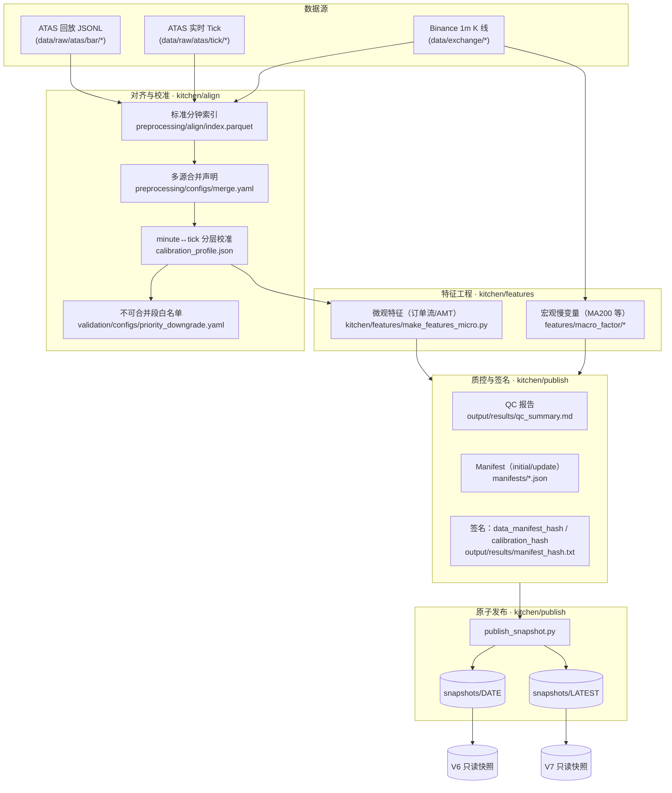

# 中央数据厨房（Data Layer, *data* 分支）

**这是什么**  
本仓库只负责“数据侧”的工作：把原始数据（ATAS、Binance）统一清洗、对齐成**数据预制菜**（只读快照），供模型仓（V6 / V7 / 未来 V8）消费。  
**不包含**任何训练/决策/回测代码；那些在各自模型仓维护。

## 为什么要拆分
- **职责单一**：数据厨房专注采集→对齐→特征→快照发布**数据**；**模型仓**专注训练→验证→发布。  
- **口径一致**：对齐与特征派生在一个地方实现，避免多处口径漂移。  
- **可追溯**：每个快照带 manifest（行数/时间窗/MD5/列清单/生成器版本）与 QC 报告。  
- **易维护**：厨房 7×24 跑在独立机器；模型端可一台或多台并行训练。

## 概念设计图

> 预览图片可通过 mermaid-cli 生成：`npx -y @mermaid-js/mermaid-cli -i README.md -o docs/diagram.png --scale 2`
